# 🛡️ SOC Automation Lab

> Automated Security Operations Center pipeline detecting Mimikatz credential dumping attacks using enterprise-grade security tools.

   

---

## 📋 Project Overview

This lab simulates a real-world SOC environment where a Mimikatz attack on a Windows endpoint is automatically detected, analyzed, escalated, and reported with zero manual intervention.

**Attack simulated:** Mimikatz credential dumping (MITRE ATT&CK T1003)

**Full pipeline:**
Windows 10 Endpoint
↓ (Sysmon logs)
Wazuh SIEM
↓ (Rule 100002 fires at Level 15)
Shuffle SOAR
↓
SHA256 Hash Extraction
↓
VirusTotal API Lookup
↓
TheHive Case Creation
↓
Email Alert to SOC Analyst

---

## 🏗️ Architecture

| Component | Role | IP |
|---|---|---|
| Wazuh Server | SIEM + Detection Engine | 192.168.239.10 |
| TheHive Server | Case Management | 192.168.239.20 |
| Windows 10 Client | Attack Target / Endpoint | 192.168.239.x |

All VMs run on VMware Workstation using NAT networking — fully isolated from external networks.

---

## 🗺️ Network Architecture Diagram
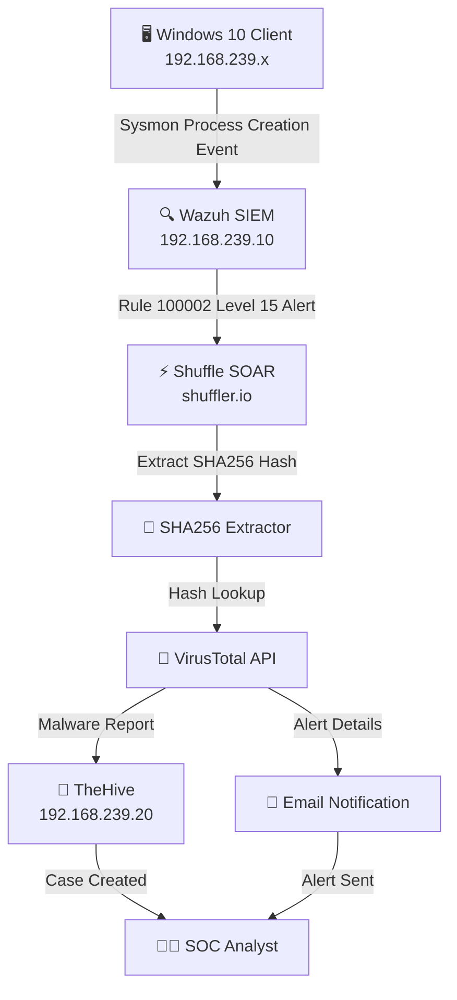

## 🛠️ Technologies Used

- **Wazuh 4.7** — Open source SIEM for log ingestion, detection and alerting
- **Shuffle SOAR** — Security automation and orchestration platform
- **TheHive 5.2** — Security incident response and case management
- **VirusTotal API** — Threat intelligence and malware hash lookup
- **Sysmon** — Windows system monitoring with SwiftOnSecurity config
- **Mimikatz** — Credential dumping tool used for attack simulation
- **VMware Workstation** — Hypervisor for isolated lab environment

---

## 🔍 Detection Logic

### Custom Wazuh Rule (Rule ID: 100002)
```xml
<rule id="100002" level="15">
  <if_group>sysmon_event1</if_group>
  <field name="win.eventdata.originalFileName" type="pcre2">(?i)mimikatz\.exe</field>
  <description>Mimikatz Usage Detected on $(win.system.computer)</description>
  <mitre>
    <id>T1003</id>
  </mitre>
</rule>
```

- Triggers on **Sysmon Event ID 1** (Process Creation)
- Detects Mimikatz via `originalFileName` field — catches renamed executables
- Fires at **Level 15** (Critical) — highest Wazuh severity
- Maps to **MITRE ATT&CK T1003** — OS Credential Dumping

---

## ⚡ Shuffle SOAR Workflow

The automated workflow consists of 5 nodes:

1. **Webhook** — Receives Level 15 alerts from Wazuh
2. **SHA256 Extractor** — Extracts file hash using regex
3. **VirusTotal** — Queries hash against 70+ antivirus engines
4. **TheHive** — Creates structured incident alert automatically
5. **Email** — Sends formatted alert to SOC analyst

---

## 📸 Screenshots

### Wazuh Dashboard — Mimikatz Alert Detected
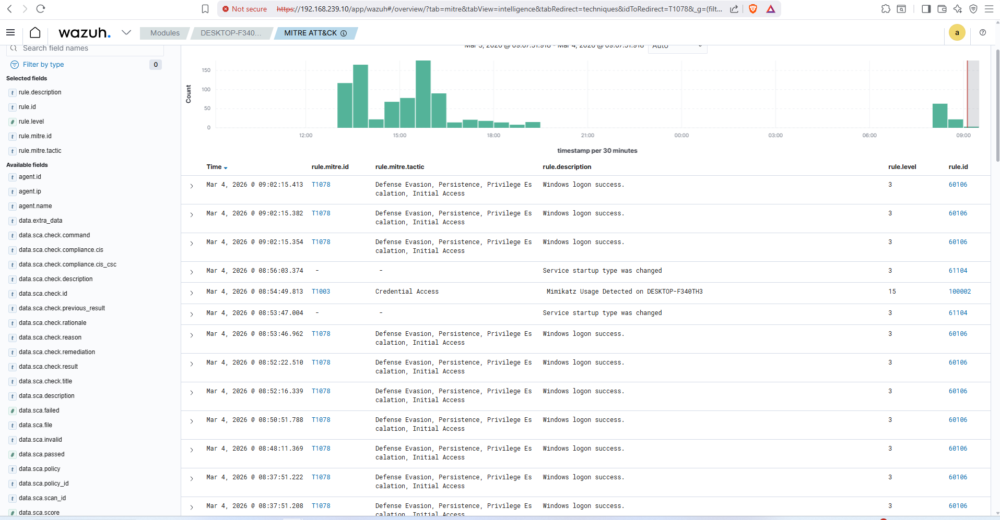
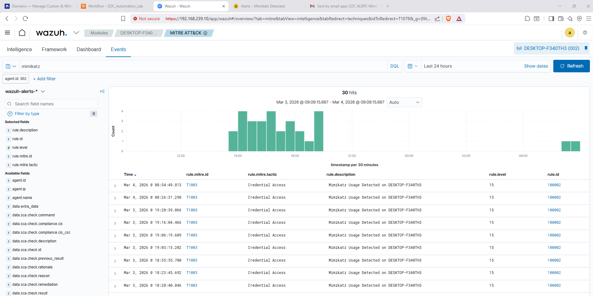
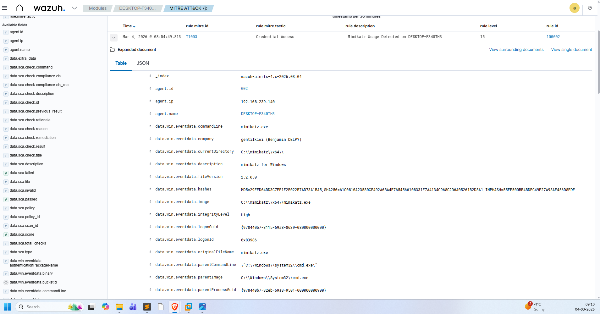

### Shuffle SOAR — Automated Workflow Execution
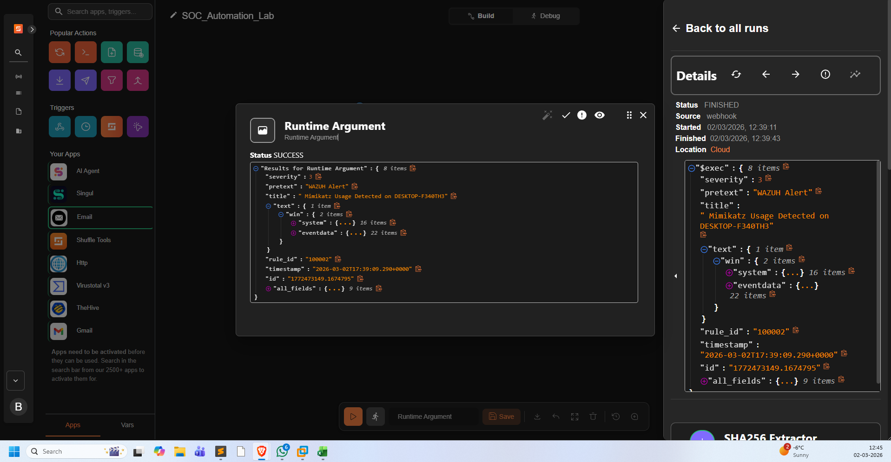
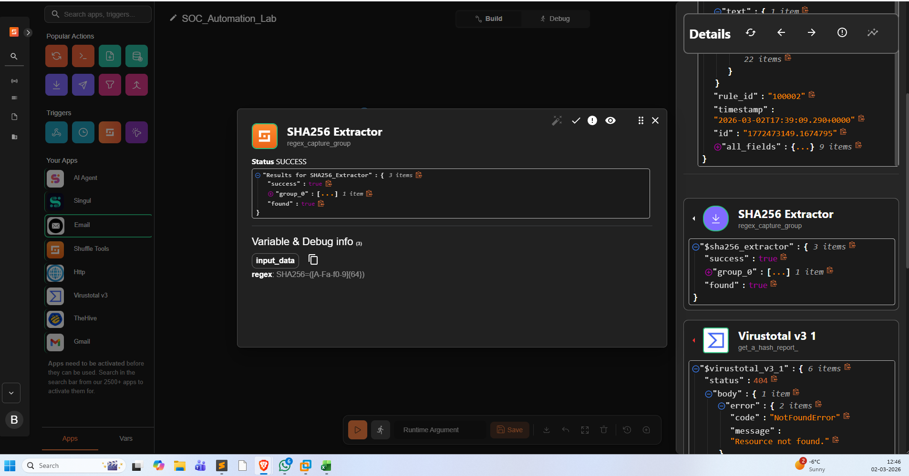
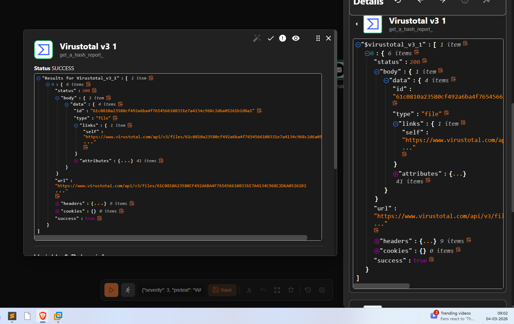
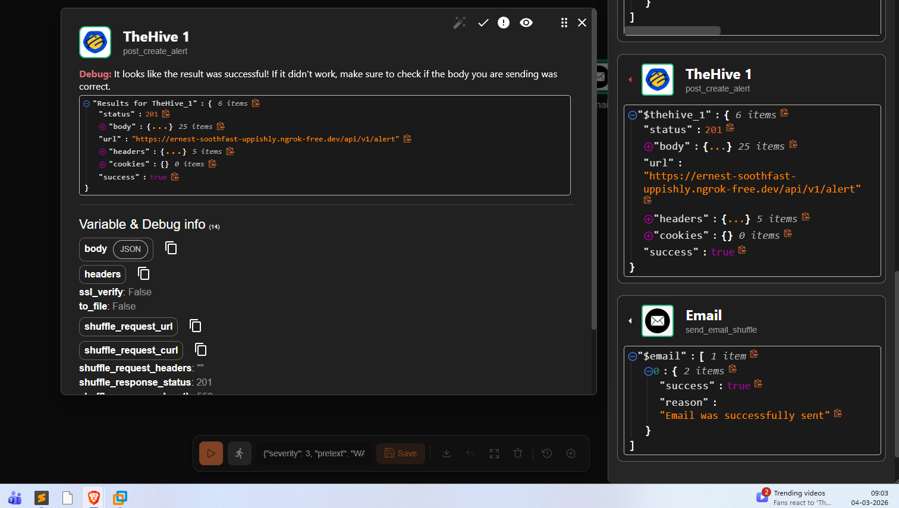
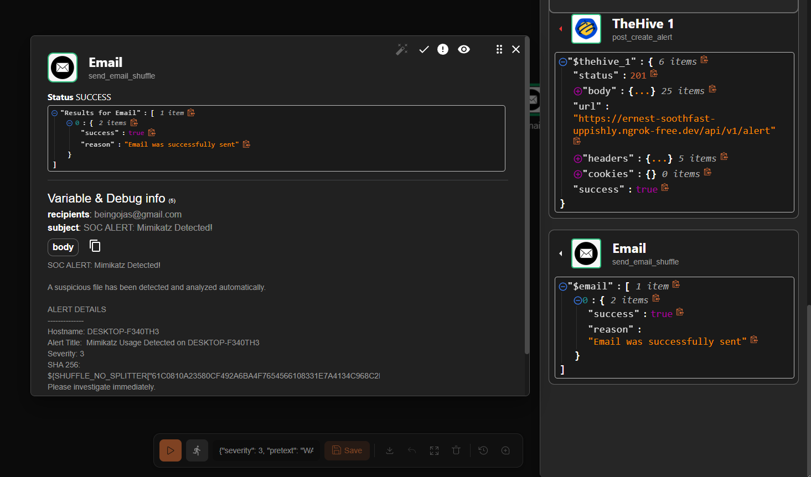

### TheHive — Case Created Automatically
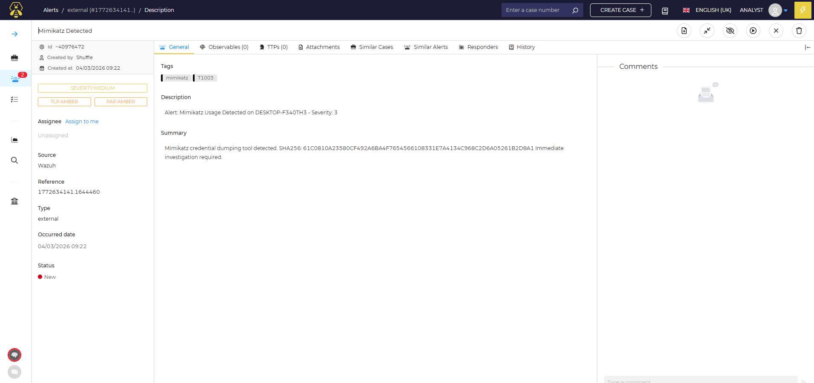

### Email Alert — SOC Analyst Notification
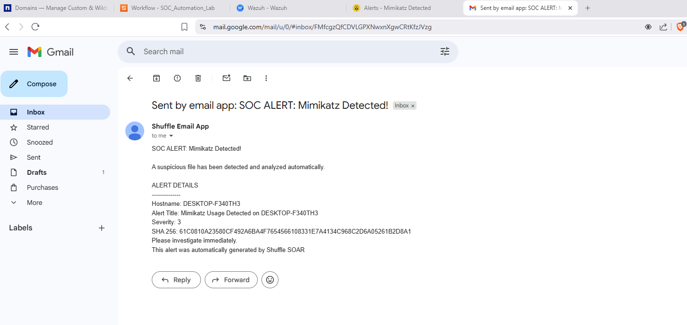


---

## 🚀 How to Reproduce This Lab

### Prerequisites
- VMware Workstation
- 16GB RAM minimum on host machine
- Ubuntu 22.04 Server ISO
- Windows 10 ISO

### Step 1 — Deploy VMs
Create three VMs on NAT network:
- Wazuh Server: Ubuntu 22.04, 4GB RAM, static IP
- TheHive Server: Ubuntu 22.04, 6GB RAM, static IP
- Windows 10 Client: 4GB RAM, DHCP

### Step 2 — Install Wazuh
```bash
curl -sO https://packages.wazuh.com/4.7/wazuh-install.sh
sudo bash wazuh-install.sh -a --ignore-check
```

### Step 3 — Install TheHive
```bash
sudo apt install docker.io -y
sudo docker run -d --name thehive -p 9000:9000 strangebee/thehive:5.2.8
```

### Step 4 — Configure Windows Endpoint
- Install Sysmon with SwiftOnSecurity config
- Install Wazuh Agent pointing to Wazuh Server IP
- Add Sysmon log ingestion to ossec.conf

### Step 5 — Add Custom Detection Rule
Add Rule 100002 to `/var/ossec/etc/rules/local_rules.xml`

### Step 6 — Build Shuffle Workflow
- Create free account at shuffler.io
- Import `scripts/SOC_Automation_Lab.json`
- Configure VirusTotal and TheHive API keys

### Step 7 — Test
Run Mimikatz on Windows endpoint and watch the full pipeline execute automatically.

---

## 📁 Repository Structure
```
SOC-Automation-Lab/
├── configs/
│   ├── ossec.conf
│   └── local_rules.xml
├── scripts/
│   └── SOC_Automation_Lab.json
├── screenshots/
└── README.md
```

## 🎯 Skills Demonstrated

- SIEM deployment and configuration (Wazuh)
- SOAR automation and workflow building (Shuffle)
- Security case management (TheHive)
- Detection engineering and custom rule writing
- API integration (VirusTotal, TheHive)
- Linux server administration (Ubuntu 22.04)
- Windows endpoint security monitoring (Sysmon)
- MITRE ATT&CK framework mapping
- Incident response pipeline automation
- Network architecture and VM management

---

## 👤 Author

**Ojas Yajnik**
Cybersecurity enthusiast building hands-on security labs

[](https://www.linkedin.com/in/ojasyajnik)
[](https://github.com/ojasy)

---

## 📜 License

MIT License — feel free to use this for your own learning.
